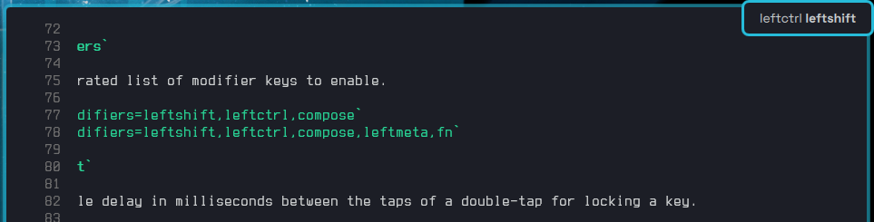

# Lollipop

Modifier key remapper bringing Android's AOSP keyboard sticky keys to Linux.

## Behavior

- Single tap a modifier to latch
- If the next tap is within 500ms the modifier is locked
- If 500ms is elapsed, the next tap unlatches the key
- Single tap in locked state unlocks the key

The 500ms delay is configurable.

## Features
- Ridiculously fast.
- Release binary size is smaller than 2MB.
- Simple `ini` config file with example provided in the repo.
- Indicates latched/locked state by switching on the Caps Lock LED.
- Touchpad support

## Getting Started

### Build

```sh
cargo build --release
```
### Install

```sh
install -o root -g root {./target/release,/usr/bin}/lollipop
cp ./systemd/lollipop.service /etc/systemd/system/lollipop.service
systemctl daemon-reload
systemctl enable --now lollipop
```

## NixOS Service

Add the input to your flake

```nix
{
  inputs.lollipop.url = "github:lavafroth/lollipop";

  outputs = { self, nixpkgs, lollipop, ... }: {
    nixosConfigurations = {
      yourMachine = nixpkgs.lib.nixosSystem {
        modules = [
          lollipop.nixosModules.default
          ./configuration.nix
        ];
      };
    };
  };
}
```

Enable the service in your `configuration.nix` file.

```nix
services.lollipop.enable = true;
```

## Configuration Options

Lollipop is configured with a simple `ini` file with `key=value` pair syntax.
Being an opinionated tool, all configuration settings are optional.
Check out the example [config file](./config.ini) which shows the use of all the
config options.

### Global Options

#### `modifiers`

A comma-separated list of modifier keys to enable.

Example: `modifiers=leftshift,leftctrl,compose`  
Default: `modifiers=leftshift,leftctrl,compose,leftmeta,fn`

#### `timeout`

The admissible delay in milliseconds between the taps of a double-tap for locking a key.

Example: `timeout=1000`  
Default: `timeout=500`

#### `device`

Specifies the input device to augment. This could bee set to a `/dev/inputX` device, where X is a positive integer.

Example: `device=/dev/input0`  
Default:`device=autodetect`

The default `autodetect` automatically picks the first keyboard device.
*Note:* Using `autodetect` can sometimes incorrectly identify peripheral devices as keyboards.

> [!NOTE]
> This option is only available to specify a keyboard when certain peripheral
devices may get incorrectly reported as keyboards.

#### `clear_all_with_escape`

When set to `true` or `yes`, pressing the escape key clears all latched and locked keys.

Example: `clear_all_with_escape=no`  
Default:`clear_all_with_escape=true`

Possible values: `true`, `yes`, `no`, `false`

#### `shared_memory`

Whether to create a file in `/dev/shm` called `lollipop.shm` to communicate the current latched and locked key states.
Useful when used in conjunction with an on-screen indicator that can watch changes to this file.

Example: `shared_memory=no`  
Default:`shared_memory=yes`

Possible values: `true`, `yes`, `no`, `false`

An example on-screen indicator is provided for use with [QuickShell](https://quickshell.org) in the [quickshell directory](./quickshell/indicator.qml).
Run it with:

```sh
quickshell -p ./quickshell/indicator.qml
```

It will spawn an indicator to the top right as seen in the screenshot.



### Touchpad Options

All options here must be placed under the `[touchpad]` section.

#### `enabled`

Whether to enable touchpad support. All latched keys are released after a single tap,
double tap or tap and drag.

Useful for actions like control-click to open a link in a new tab.

Example: `enabled=no`  
Default: `enabled=yes`

Possible values: `true`, `yes`, `no`, `false`

#### `timeout`

The duration between a the two taps of a double tap. If a second tap doesn't occur within
this duration, all latched keys will be released.

Some apps only respond to actions like control-click if the control is held for a small duration
after the click is released.

Example: `timeout=0`  
Default: `timeout=200`

### `slop`

A touch is registered as a tap even if the finger moves slightly by this amount of touchpad units.
Defaults to a small tolerable value but might require tweaking for different physical touchpad sizes.

Example: `slop=120`  
Default: `slop=50`

# Extra Goodies

## KDE Plasma Indicator

```sh
mkdir -p ~/.local/bin
cargo build --release --package lollipop-dbus
cp ./target/debug/lollipop-dbus ~/.local/bin/
cat << EOF > ~/.config/autostart/lollipop-dbus.desktop
[Desktop Entry]
Exec=$HOME/.local/bin/lollipop-dbus
Icon=application-x-executable
Name=lollipop-dbus
Type=Application
X-KDE-AutostartScript=true
EOF
kpackagetool6 --type Plasma/Applet --install xyz.lavafroth.lollipop.indicator
```
